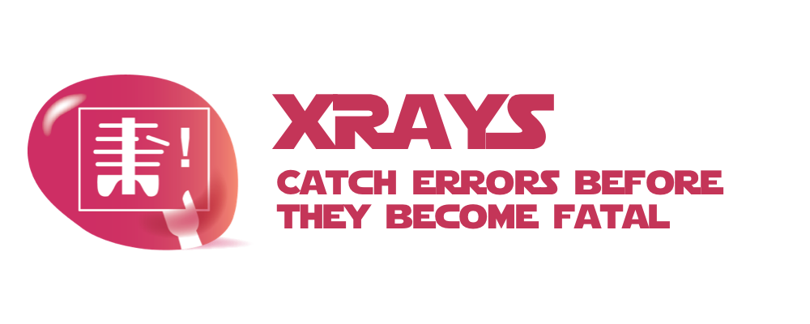

# xrays



> An [Open Source Universe](https://github.com/intellibus/approach) Project

---

## Contents

- [xrays](#xrays)
  - [Contents](#contents)
  - [Features ✨](#features-)
  - [Install 🛠](#install-)
  - [Usage 🔭](#usage-)
  - [Documentation 🛰](#documentation-)
  - [Contributing 🌎](#contributing-)
  - [License ⚖️](#license-️)

## Features ✨

- Catches Errors Before they become Fatal
- 0 Dependencies
- Typescript Support

## Install 🛠

```sh
npm install xrays
```

## Usage 🔭

`xrays` *is under active development, the code sample below is a preview & is subject to change*
Read more about the [Design Document](https://github.com/intellibus/xrays/DESIGN.md) behind `xrays` here.

```typescript
import { x } from 'xrays';

const throwable = async (shouldThrow: boolean) => {
  if (shouldThrow) {
    throw new Error('error');
  }
  return 'success';
}

const { data, error } = await x(throwable, false);
// { data: 'success', error: null }

const { data, error } = await x(throwable, true);
// { data: null, error: Error('error') }
```

## Documentation 🛰

`xrays` *is under active development, documentation will be added once a* `beta` *release is ready*

## Contributing 🌎

Please make sure to read the [Design Document](https://github.com/intellibus/xrays/DESIGN.md) before making a pull request.

## License ⚖️

MIT
